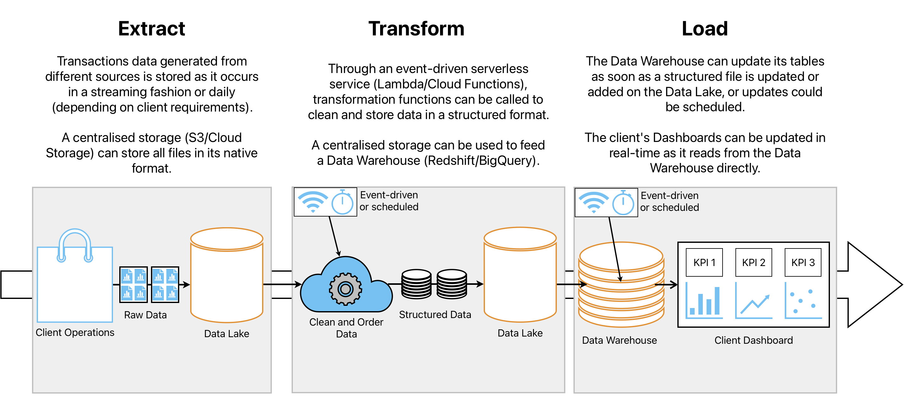

# ETL Pipeline - Crypto Transactions

Python ETL Pipeline that pulls crypto transactions data from a 
[Google BigQuery public dataset](https://console.cloud.google.com/marketplace/product/public-data-finance/crypto-zilliqa-dataset), 
performs summarizations and aggregations, and then stores the data
on a [LocalStack S3 Bucket](https://docs.localstack.cloud/user-guide/aws/s3/).

## Stack
- Docker Compose 
  - Apache Airflow
    - Python Operators
      - Google Cloud BigQuery API
      - AWS SDK for Python (Boto3)
  - LocalStack
    - S3 Bucket

## Features
- Google BigQuery API 
- SQL Queries
- E-mail notifications on retry/failure

## Setup
Make sure to have [Docker Compose](https://docs.docker.com/compose/install/) 
installed and that Docker Engine is running. Also, a way to open .parquet files 
is recommended (i.e. [Tad](https://www.tadviewer.com/)).

1. Place the credentials file provided at `./credentials/`.

2. From the project directory, build and run the app by running `docker-compose up -d`.
```pycon
[+] Running 6/7
 ⠦ Network airflow_default                Created
 ✔ Container localstack                   Started
 ✔ Container airflow-postgres-1           Healthy
 ✔ Container airflow-airflow-init-1       Exited
 ✔ Container airflow-airflow-scheduler-1  Started
 ✔ Container airflow-airflow-triggerer-1  Started
 ✔ Container airflow-airflow-webserver-1  Started  
```

3. Open the Airflow GUI on http://localhost:8080/ and login
with user `airflow` and password `airflow`. If DAG `zilliqa-transactions-DAG`
is paused, please unpause it and it should shortly start executing.

4. Once the run has been marked with the `success` tag, you can check the 
S3 Bucket on http://localhost:4566/zilliqa-transactions. It should have two
.parquet files, each specified under a `<Contents>` tag:
```pycon
# ...
<Contents>
<Key>transactions.parquet</Key>
# ...
# ...
<Contents>
<Key>receivers.parquet</Key>
```

5. Parquet files can be downloaded from:
- http://localhost:4566/zilliqa-transactions/transactions.parquet
- http://localhost:4566/zilliqa-transactions/receivers.parquet

6. The container can be terminated by running `docker-compose down`.

## Dataset Break-down
The pipeline extracts data from a crypto transactions table via
Google BigQuery's API. The data is transformed using SQL queries that performed
summarizations in the following form:
````
Table 1
- Daily metrics for August 2022 
   - Number of Transactions
   - Successful Transactions
   - Success Rate
   - Unique Senders
   - Unique Receivers
   - Average cost of gas
   - Average amount sent 
````
````
Table 2
- August 2022 metrics for top 20 addresses with most transactions received
   - Number of Transactions
   - Average cost of gas
   - Total amount received
````
### Production Architecture
Actions performed in this pipeline such as storing a file locally
or using LocalStack are restricted to development environments
and have to be replaced for production. The project can be scaled
and used in production by using scalable and modular cloud infrastructure
services such as Data Lakes (AWS S3, Azure Blob Storage, Google Cloud Storage)
Data Warehouses (Redshift, Databricks, Google BigQuery) and serverless
FaaS (AWS Lambda, Google Cloud Functions).



