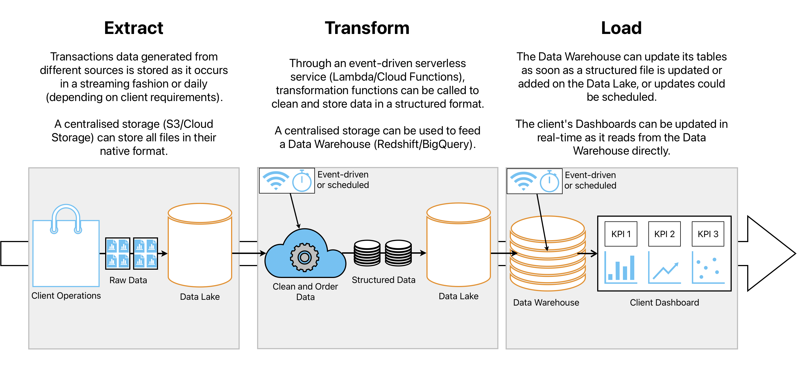

# ETL Pipeline - Crypto Transactions

Python ETL Pipeline that pulls crypto transactions data from a 
[Google BigQuery public dataset](https://console.cloud.google.com/marketplace/product/public-data-finance/crypto-zilliqa-dataset)
and stores it locally on an SQLite database. Then, performs summarizations and
aggregations, and then stores the data
on a [LocalStack S3 Bucket](https://docs.localstack.cloud/user-guide/aws/s3/).

## Stack
- Docker Compose 
  - Apache Airflow
    - Python Operators
      - Google Cloud BigQuery API
      - SQLite Database
      - AWS SDK for Python (Boto3)
  - LocalStack
    - S3 Bucket

## Features
- Google BigQuery API 
- SQL Queries
- E-mail notifications on retry/failure

## Setup
Make sure to have [Docker Compose](https://docs.docker.com/compose/install/) 
installed and that Docker Engine is running. Also, a way to open .parquet files 
is recommended (i.e. [Tad](https://www.tadviewer.com/)).

1. Clone the repository
```
git clone https://github.com/Zekda96/transactions-etl-pipeline.git
```
2. Create a folder named `credentials` in the project directory and place the credentials file there.

3. From the project directory, build the container by running `docker-compose up -d`.
```pycon
[+] Running 8/7
 ✔ Container localstack                            Running 
 ✔ Container transactions-etl-postgres-1           Healthy 
 ✔ Container transactions-etl-redis-1              Healthy  
 ✔ Container transactions-etl-airflow-init-1       Exited
 ✔ Container transactions-etl-airflow-scheduler-1  Running     
 ✔ Container transactions-etl-airflow-triggerer-1  Running  
 ✔ Container transactions-etl-airflow-webserver-1  Running 
 ✔ Container transactions-etl-airflow-worker-1     Started    
```

4. Open the Airflow GUI on http://localhost:8080/ and login
with user `airflow` and password `airflow`. If DAG `zilliqa-transactions-DAG`
is paused, please unpause it and it should shortly start executing.

5. Once the run has been marked with the `success` tag, you can check the 
S3 Bucket on http://localhost:4566/zilliqa-transactions. It should have two
.parquet files, each specified under a `<Contents>` tag:
```pycon
# ...
<Contents>
<Key>transactions_summary.parquet</Key>
# ...
# ...
<Contents>
<Key>receivers_summary.parquet</Key>
```

6. Parquet files can be downloaded from:
- http://localhost:4566/zilliqa-transactions/transactions_summary.parquet
- http://localhost:4566/zilliqa-transactions/receivers_summary.parquet

7. The container can be terminated by running `docker-compose down`.

## Dataset Breakdown
The pipeline extracts 1.3M rows of data from a crypto transactions table via
Google BigQuery's API. The data is transformed using SQL queries that performed
summarizations in the following form:
````
Table 1
- Daily metrics (2022-08-01 to 2022-09-07)
   - Number of transactions
   - Successful transactions
   - Success rate
   - Number of unique senders
   - Number of unique receivers
   - Average cost of gas
   - Average amount sent 
````
````
Table 2
- All addresses ordered by most transactions received (2022-08-01 to 2022-09-07)
   - Number of transactions
   - Average cost of gas
   - Total amount received
````
### Practical Considerations
The pipeline is capable of handling the load of the entire database from BigQuery, however,
for the purpose of this project, it has been reduced to all recorded 
transactions later than 2022-08-01, which reduces the data pulled from
41M rows to 1.3M rows. This allows the 'extract_data' task to run in
around 3 minutes, instead of the approximately 120 minutes it would take to
load the entire dataset.

In order to pull the whole dataset, line `134` from `extract_data.py` can be 
commented out.
```
WHERE DATE(block_timestamp) >= DATE(2022,08,01)
```


## Production Architecture
Actions performed in this pipeline such as storing a file locally
or using LocalStack are restricted to development environments
and have to be replaced for production. The project could be scaled
and used in production by using modular cloud infrastructure
services such as Data Lakes (AWS S3, Azure Blob Storage, Google Cloud Storage)
Data Warehouses (Redshift, Databricks, Google BigQuery) and serverless
FaaS (AWS Lambda, Google Cloud Functions).


